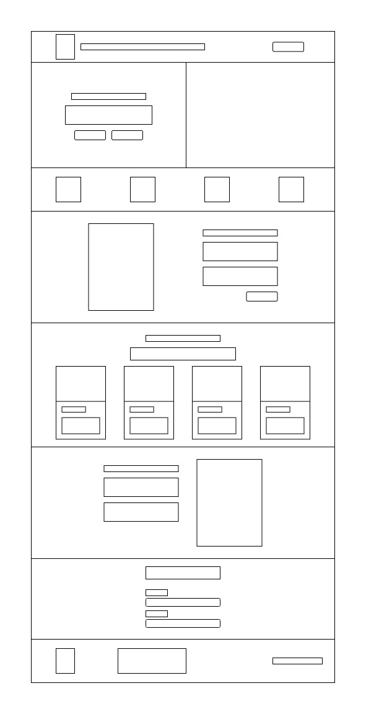

# Sitio web Cafetería "Café y Brownie"

Se desarrolla una página web básica tipo landing page para la cafetería **"Café y Brownie"**, utilizando tecnologías como **HTML5, CSS3 y Bootstrap 5**. El diseño es responsivo.

**La estructura está organizada en las siguientes secciones:**
--

1. **Header**: encabezado principal con el nombre o logo de la cafetería.

2. **Nav**: barra de navegación.

3. **Main**: contenido principal.

4. **Section de productos**: se muestran los productos que ofrece la cafetería.

5. **Footer**: pie de página con información.

**Diagrama del sitio**
---

---

## Autor

❤️ Este código fue desarrollado en un **90% por Marco Rubio Bustos, 10% por el apoyo de AI**.
